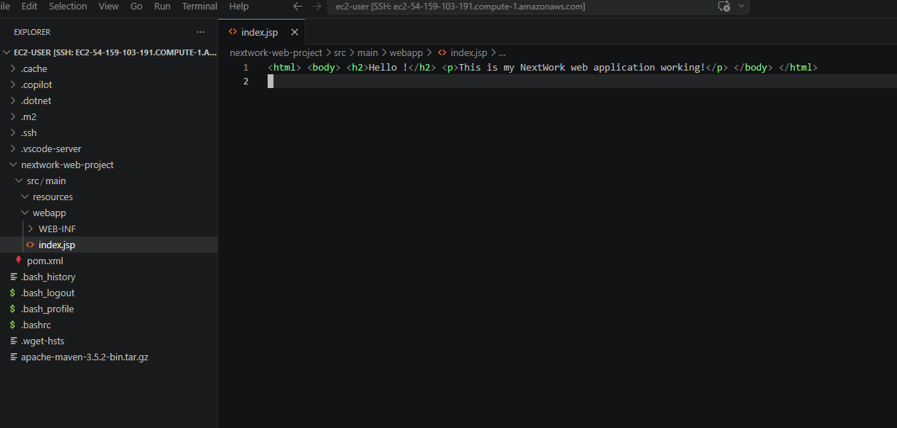
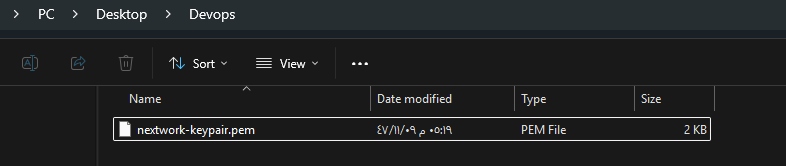
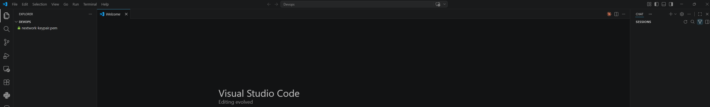
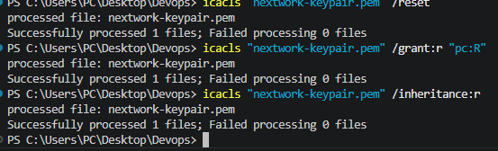
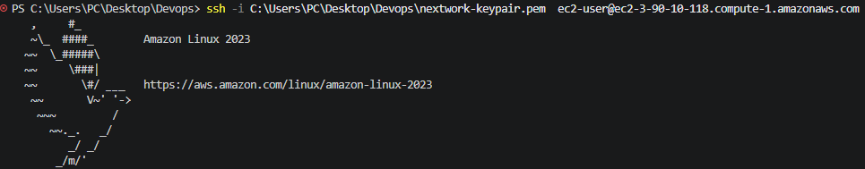
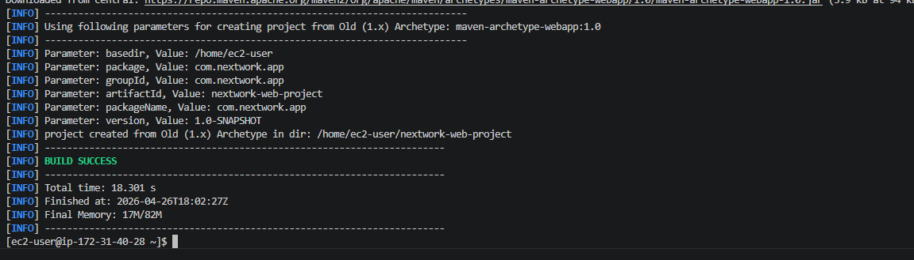
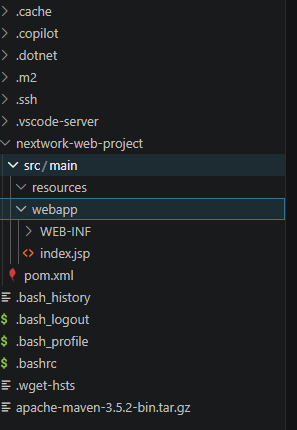
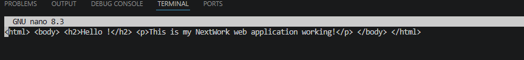

---

## Set Up a Web App Using AWS and VS Code

---

## Introducing Today's Project!

In this project, I will set up a web application using AWS EC2 and VS Code. This is part one of a 6 Day DevOps Challenge where I'm building a complete CI/CD pipeline.

### Key tools and concepts

- **AWS EC2** - Virtual server in the cloud
- **VS Code** - Integrated Development Environment (IDE)
- **SSH** - Secure connection to remote servers
- **Maven** - Build automation tool for Java projects
- **Java (Amazon Corretto 8)** - Programming language runtime

## Launching an EC2 instance

### What I did in this step

I launched an EC2 instance to host my web application in the cloud.

### EC2 Instance Configuration

| Setting | Value |
|---------|-------|
| Name | `nextwork-devops-` |
| AMI | Amazon Linux 2023 (kernel-6.1) |
| Instance Type | t3.micro (free tier eligible) |
| Key Pair | `nextwork-keypair` (RSA, .pem format) |

### I also enabled SSH

I configured SSH traffic to only allow connections from **My IP** address, ensuring only I can access the instance.
### Key pairs

A key pair is like the keys to your virtual computer. It has two parts:
- **Public key** - Stored by AWS
- **Private key** - Downloaded to your computer (keep it safe!)
### Downloaded key pair file

Once I set up my key pair, AWS automatically downloaded the private key file (.pem) to my computer.

---

## Set up VS Code

### What I did in this step

I installed VS Code and configured my terminal to connect to the EC2 instance.

### What is VS Code?

VS Code is an Integrated Development Environment (IDE) that helps write and edit code, similar to how Microsoft Word helps write documents.
.

---

### Updating file permissions

I also updated my private key's permissions by running `chmod 400 nextwork-keypair.pem` (Mac/Linux) or `icacls` commands (Windows).

---

## SSH connection to EC2 instance

### What I did in this step

I established an SSH connection from VS Code to my EC2 instance.

### Connecting to EC2

To connect to my EC2 instance, I ran the command (ssh -i ~/Desktop/DevOps/nextwork-keypair.pem ec2-user@YOUR-PUBLIC-DNS)

### This command required an IPv4 address

A Public DNS (Domain Name System) is the public address that the internet uses to find and connect to your EC2 server.

---

## Maven & Java

### What I did in this step

I installed Apache Maven and Amazon Corretto 8 (Java) on the EC2 instance.

### Why I'm using Maven

Apache Maven is a tool that helps build and organize Java projects. It automatically downloads external dependencies and provides templates (archetypes) for different project types.

### Why I'm using Java

Maven NEEDS Java to operate. Amazon Corretto 8 is a free, reliable Java distribution provided by AWS.

---

## Create the Application

### What I did in this step

I used Maven to generate a Java web application from a template.

### Installing Remote - SSH

I installed the Remote-SSH extension to use VS Code's full IDE features on my EC2 instance.

### SSH configuration details

SSH in the terminal only lets you send text commands. Remote-SSH unlocks VS Code's file navigation and code editing directly on the EC2 instance.

---

## Create the Application

### Exploring the project structure

I opened the web app folder in VS Code and edited the index.jsp file.

---

## Using Remote - SSH

### Updating the web app

index.jsp is similar to HTML but can include Java code to generate dynamic content (content that changes based on user input or database data). HTML files are static and cannot include Java code.

---

### Verifying my work

To verify my editing work in the terminal, I used `cat index.jsp` to display the file contents. It was possible to see my changes in VS Code right away because both the terminal and VS Code are connected to the same EC2 instance via SSH.

---

---
