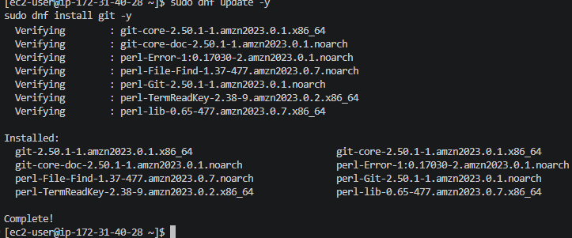
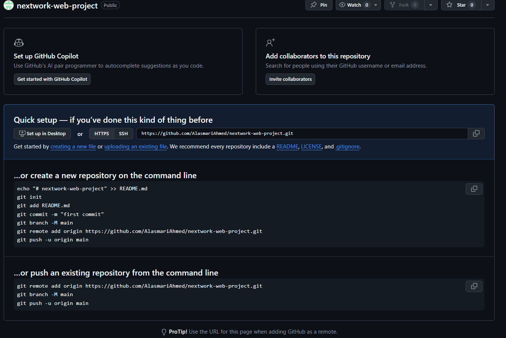
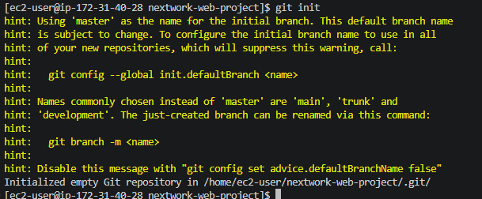
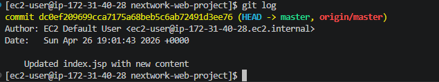
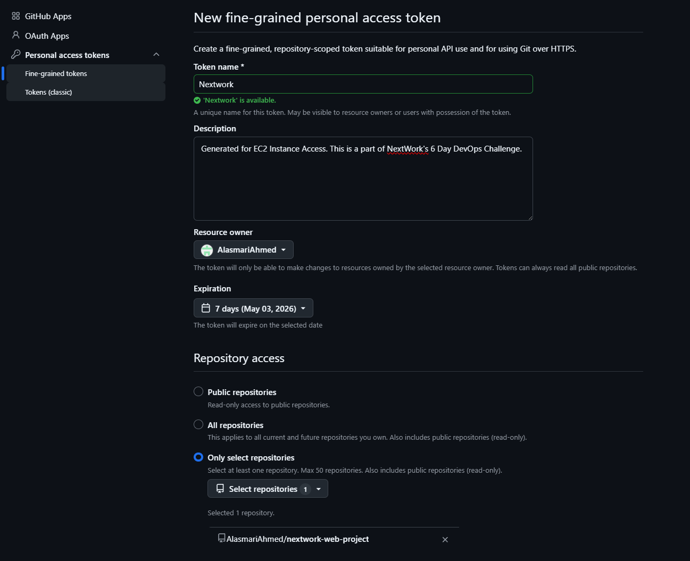
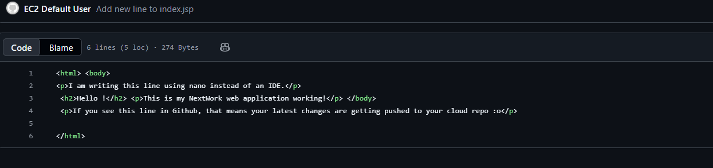
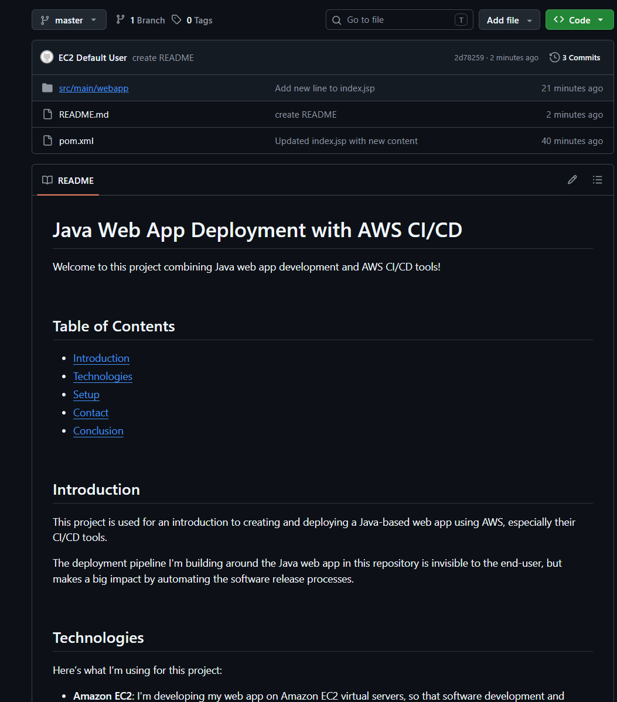

# Connect a GitHub Repo with AWS

---

## Connect a GitHub Repo with AWS

---

## Introducing Today's Project!

In this project, I connected my Java web application (created on an EC2 instance) to a GitHub repository. This is part two of the 6 Day DevOps Challenge where I'm building a complete CI/CD pipeline.

### Key tools and concepts

| Tool/Concept | Purpose |
|--------------|---------|
| **Git** | Version control system that tracks changes to code |
| **GitHub** | Cloud platform to store and share Git repositories |
| **Git Init** | Creates a local repository in your project folder |
| **Git Add** | Stages files for commit |
| **Git Commit** | Saves staged changes with a message |
| **Git Push** | Uploads local commits to remote repository |
| **Personal Access Token** | Secure authentication method for GitHub |

### Project reflection

This project took me approximately **1-2 hours** to complete. The most challenging part was understanding the difference between local and remote repositories, and setting up the GitHub token for authentication. It was most rewarding to see my web app files appear on GitHub after the first successful push.

I did this project because version control is an essential skill for any DevOps engineer, and GitHub is the industry standard for hosting and sharing code.

This project is part two of a series of DevOps projects where I'm building a CI/CD pipeline! In the next project, I'll work with AWS CodeArtifact to manage dependencies.

---

## Git and GitHub

Git is a **version control system** that tracks every change made to your code, allowing you to go back to earlier versions if something breaks. I installed Git on my EC2 instance using commands 

GitHub is a cloud platform where developers store and share their Git repositories. I'm using GitHub in this project to store my web app code remotely, making it accessible from anywhere and enabling collaboration.

---

## My local repository

A Git repository (repo) is a folder that contains all your project files and their entire version history.

git init is a command that creates a new local Git repository in your current directory. I ran git init inside my nextwork-web-project folder.

A branch in Git is like a parallel version of your project. The default branch is called master (or main). After running git init, the terminal showed a message about setting up the master branch.

---

## To push local changes to GitHub, I ran three commands

### git add

The first command I ran was git add . A staging area is where Git collects all your modified files for final review before committing them.

### git commit

The second command I ran was git commit -m "Updated index.jsp with new content". Using -m means you're adding a message describing what the commit contains.

### git push

The third command I ran was git push -u origin master. Using -u sets an upstream branch, so next time I can just run git push without extra parameters.

---

## Authentication

When I commit changes to GitHub, Git asks for my credentials because it needs to verify I have permission to push to the remote repository.

### Local Git identity

Git needs my name and email because every commit is tagged with an author for accountability and tracking.

Running git log showed me the commit history, including who made each change and when.

---

## GitHub tokens

GitHub authentication failed when I entered my password because GitHub no longer accepts password authentication over HTTPS due to security risks.

A GitHub token (Personal Access Token) is a unique string of characters that acts as a secure replacement for a password. I'm using one in this project because it's more secure and required by GitHub.

I set up a GitHub token by:

Going to Settings → Developer settings → Personal access tokens

Selecting "Tokens (classic)" → "Generate new token (classic)"

Adding a description and setting expiration to 7 days

Selecting the repo scope

Copying the generated token immediately

---

## Making changes again

I wanted to see Git working in action, so I edited index.jsp and added a new line. I couldn't see the changes in my GitHub repo initially because saving changes in VS Code only updates the local repository - I needed to push them to GitHub.

I finally saw the changes in my GitHub repo after running commands

---

## Setting up a READMe file

As a finishing touch to my GitHub repository, I added a README file, which is a document that introduces and explains your project. I added a README file by running touch README.md in my terminal.

My README is written in Markdown because it's a lightweight language that formats text cleanly on GitHub. Special characters can help you format text in Markdown, such as # for headers, ** for bold text, and - for bullet points.

My README file has 6 sections that outline:

Introduction

Technologies used

Setup instructions

Contact information

Conclusion

Project acknowledgments

---

---
