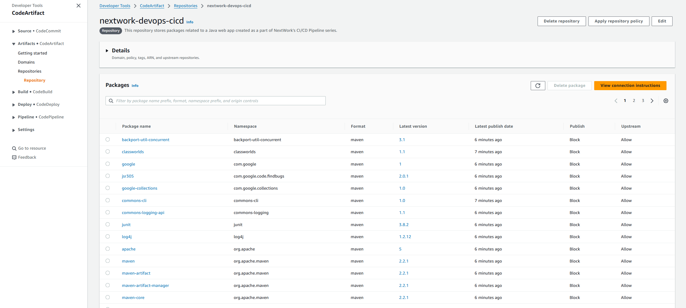
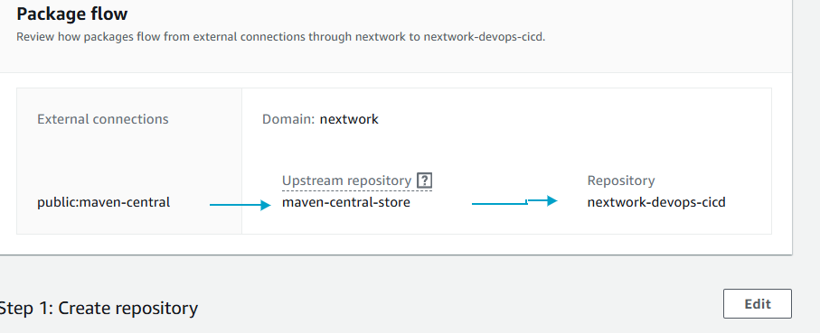
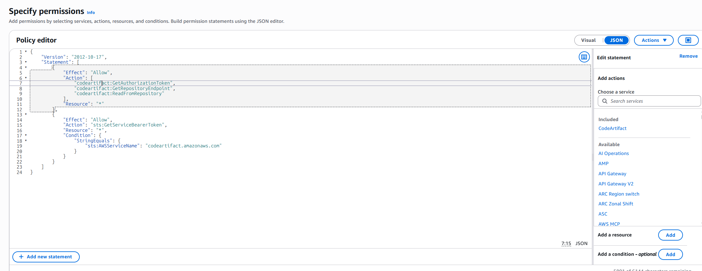
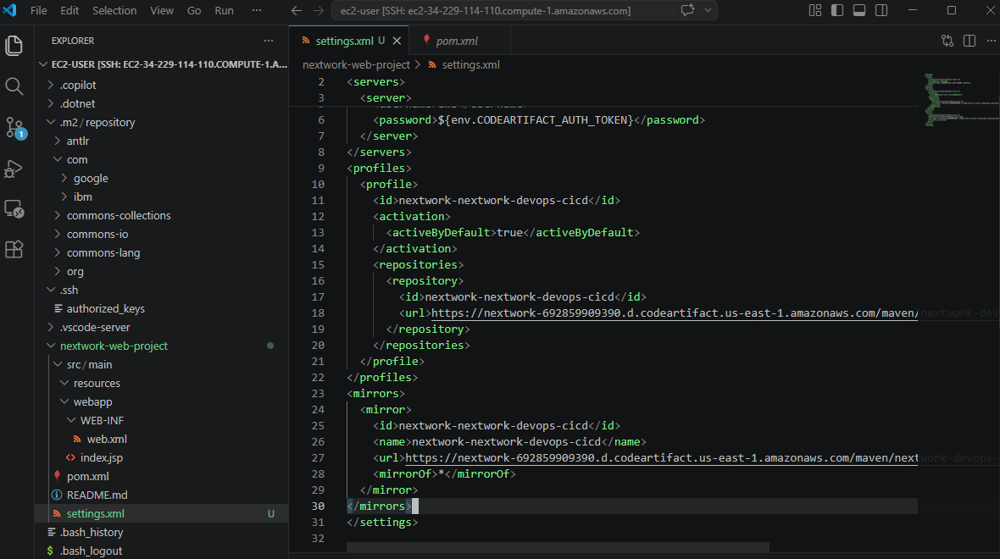
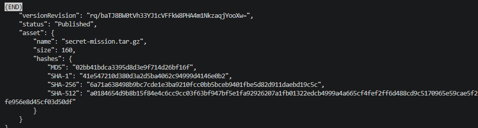

# Secure Packages with CodeArtifact

---

---

## Introducing Today's Project!

In this project, I set up AWS CodeArtifact to securely store and manage my Java web app's dependencies. This is part three of the 6 Day DevOps Challenge where I'm building a complete CI/CD pipeline.
### Key tools and concepts

| Tool/Concept | Purpose |
|--------------|---------|
| **AWS CodeArtifact** | Fully managed artifact repository for software packages |
| **Maven Central** | Public repository for Java libraries (like an "App Store" for Java) |
| **Upstream Repository** | Backup library that CodeArtifact checks when it doesn't have a package |
| **IAM Role** | Set of permissions assigned to EC2 instance for secure access |
| **IAM Policy** | Document specifying exactly what actions are allowed/denied |
| **settings.xml** | Maven configuration file that tells Maven where to find dependencies |
| **Personal Access Token** | Temporary authentication token for CodeArtifact access |

### Project reflection

This project took me approximately **2-3 hours** to complete. The most challenging part was understanding the IAM role and policy setup, and troubleshooting the "Unable to locate credentials" error. It was most rewarding to see the dependencies automatically appear in my CodeArtifact repository after running the Maven compile command.

I did this project because managing dependencies securely is critical for CI/CD pipelines - CodeArtifact provides a centralized, secure way to store and share packages across teams.

This project is part three of a series of DevOps projects where I'm building a CI/CD pipeline! In the next project, I'll work with AWS CodeBuild for continuous integration.

---

## CodeArtifact Repository

**CodeArtifact** is a secure, centralized place to store all your software packages. Engineering teams use artifact repositories because they provide:

1. **Security** - Everyone retrieves packages from a secure repository instead of unsafe public sources
2. **Reliability** - If public package websites go down, you have backups
3. **Control** - Teams can share the same versions of packages consistently

A **domain** is like a folder that holds multiple repositories belonging to the same project or organization. My domain is `nextwork`.

A CodeArtifact repository can have an **upstream repository**, which means when your app looks for a package not in your repository, CodeArtifact checks its upstream repositories (like Maven Central) to find it. My repository's upstream repository is `maven-central-store` (the public Maven Central repository).

---

## CodeArtifact Security

### Issue

To access CodeArtifact, we need an **authorization token** (a temporary ID badge for build tools). I ran into an "Unable to locate credentials" error when retrieving a token because my EC2 instance didn't have permission to access CodeArtifact.
### Resolution

To resolve the error with my security token, I created an IAM policy and attached it to an IAM role, then associated that role with my EC2 instance. This resolved the error because the EC2 instance now has the necessary permissions to request tokens from CodeArtifact.

It's security best practice to use IAM roles because:
- AWS automatically provides and rotates temporary credentials
- No hardcoded credentials stored in configuration files
- Follows the "principle of least privilege"

---

## The JSON policy attached to my role

The JSON policy I set up grants permissions to:
- Get authorization tokens from CodeArtifact
- Find repository endpoints
- Read packages from repositories
- Request service bearer tokens specifically for CodeArtifact

---

## Maven and CodeArtifact

### To test the connection between Maven and CodeArtifact, I compiled my web app using settings.xml

To test the connection between Maven and CodeArtifact, I compiled my web app using settings.xml
The settings.xml file is Maven's control center - it tells Maven where to find dependencies and how to authenticate. It contains three main sections:

---

## Verify Connection

After compiling, I checked my CodeArtifact repository in the AWS Console. I noticed that Maven dependencies (packages like javax.servlet, junit, etc.) had automatically appeared in my repository!

This happened because:

Maven checked my pom.xml to see what dependencies my app needs

It requested these dependencies through CodeArtifact

CodeArtifact fetched them from Maven Central (upstream)

CodeArtifact stored copies in my repository for future use

---

## Uploading My Own Packages

In a project extension, I also decided to publish my own custom package to CodeArtifact. This is useful in situations where companies want to share internal libraries privately without exposing intellectual property to the public.

To create my own package, I created a text file and bundled it into a tar.gz archive. I also generated a security hash because CodeArtifact requires a SHA256 hash to verify package integrity (like a digital fingerprint).

To publish the package, I used the AWS CLI command aws codeartifact publish-package-version. When I look at the package details in CodeArtifact, I can see the version information, publication timestamp, and security hashes.

To validate my packages, I then downloaded the package back from CodeArtifact using the AWS CLI and extracted it to verify the contents. I saw my original secret message!

---

---
