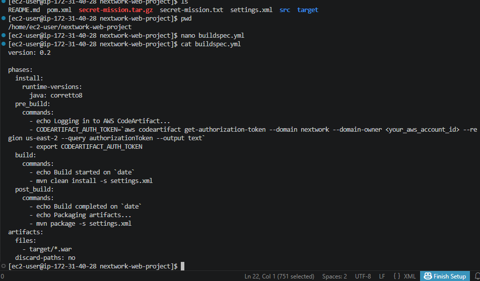
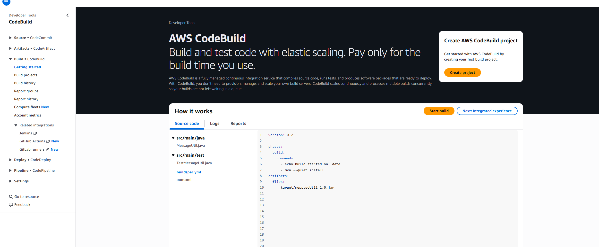
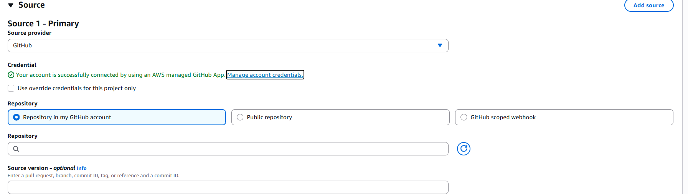
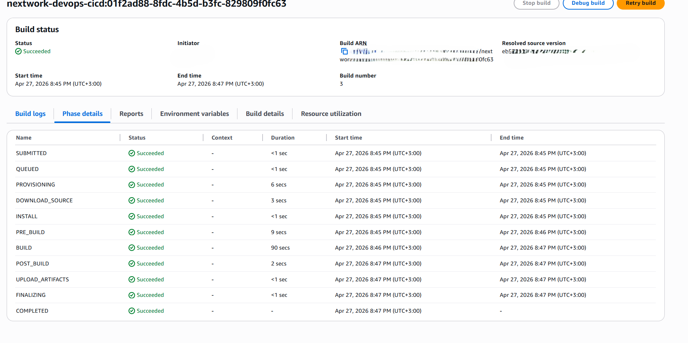
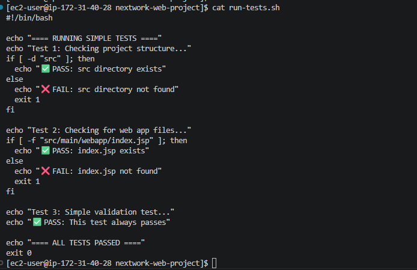

# Continuous Integration with CodeBuild


---



---

## Introducing Today's Project!

In this project, I set up AWS CodeBuild to automatically build and test my Java web application whenever code changes are pushed to GitHub. This is part four of the 6 Day DevOps Challenge where I'm building a complete CI/CD pipeline.
### Key tools and concepts

| Tool/Concept | Purpose |
|--------------|---------|
| **AWS CodeBuild** | Fully managed continuous integration service that compiles code, runs tests, and produces deployable artifacts |
| **buildspec.yml** | YAML file that tells CodeBuild exactly what commands to run at each build stage |
| **AWS CodeConnections** | Secure bridge between AWS and GitHub for authentication |
| **Build Artifacts** | Output files from the build process (e.g., WAR files) |
| **Amazon S3** | Storage location for build artifacts |
| **CloudWatch Logs** | Monitoring service that records everything during the build |
| **Continuous Integration (CI)** | Practice of automatically building and testing code changes frequently |

### Project reflection

This project took me approximately **2-3 hours** to complete. The most challenging part was troubleshooting the build failures - first missing buildspec.yml, then permission issues with CodeArtifact. It was most rewarding to see the build succeed with a green checkmark and find the WAR file artifact in my S3 bucket.

I did this project because CI is essential for modern DevOps - it catches bugs early, ensures code quality, and automates the repetitive parts of building software.

This project is part four of a series of DevOps projects where I'm building a CI/CD pipeline! In the next project, I'll work with AWS CodeDeploy to deploy my web application.

---

## Setting up a CodeBuild Project

**CodeBuild** is a fully managed continuous integration service that takes your source code, compiles it, runs tests, and packages it up. Engineering teams use it because you don't have to manually set up build servers - you only pay for the compute time you use.

My CodeBuild project's source configuration connects to my GitHub repository `nextwork-web-project` using AWS CodeConnections. I selected the default project type, which gives full control over the build process within AWS.





---

## Connecting CodeBuild with GitHub

There are multiple credential types for GitHub, like **GitHub App** (simplest and most secure), **Personal Access Token** (requires manual token management), and **OAuth App** (more complex but granular permissions). I used **GitHub App** because AWS manages the connection, reducing the need to handle tokens directly.

The service that helped connect AWS to GitHub is **AWS CodeConnections** - it acts as a secure bridge, handling all authentication complexity behind the scenes.





---

## CodeBuild Configurations

### Environment

My CodeBuild project's Environment configuration defines the operating system, runtime, and compute resources. It includes settings like:

| Setting | My Choice | Why |
|---------|-----------|-----|
| Provisioning model | On-demand | Resources created only during build (cost-effective) |
| Operating system | Amazon Linux | Matches my EC2 instance |
| Runtime | Standard | Supports Java Corretto 8 |
| Image | corretto8 | Pre-configured with Java 8 |

### Artifacts

**Build artifacts** are the tangible outputs of the build process (compiled code, packages, deployable files). They're important because they're what you actually deploy to servers. My build process will create a `.war` file (Web Application Archive). To store them, I created an S3 bucket named `nextwork-devops-cicd-enter your name`.

### Packaging

When setting up CodeBuild, I chose to package artifacts as a **Zip file** because:
- Compression reduces file size (faster uploads, lower storage costs)
- Single file is easier to manage than multiple individual files
- Simpler deployment process

### Monitoring

For monitoring, I enabled **CloudWatch Logs**, which records everything during the build process - commands run, outputs, and errors - making debugging much easier.

---


---

## buildspec.yml

My first build failed with error `YAML_FILE_ERROR: YAML file does not exist`. A **buildspec.yml** file is needed because CodeBuild reads it as a step-by-step instruction manual for the build process.

### The four phases in my buildspec.yml file:

| Phase | What it does |
|-------|--------------|
| **install** | Sets up the runtime environment (Java Corretto 8) |
| **pre_build** | Prepares before building (gets CodeArtifact auth token) |
| **build** | The actual building and testing (compiles code, runs tests) |
| **post_build** | Finishing touches (packages WAR file) |

### My buildspec.yml file:

```yaml
version: 0.2

phases:
  install:
    runtime-versions:
      java: corretto8
  pre_build:
    commands:
      - echo Logging in to AWS CodeArtifact...
      - CODEARTIFACT_AUTH_TOKEN=`aws codeartifact get-authorization-token --domain nextwork --domain-owner YOUR_ACCOUNT_ID --region YOUR_REGION --query authorizationToken --output text`
      - export CODEARTIFACT_AUTH_TOKEN
  build:
    commands:
      - echo Build started on `date`
      - mvn clean install -s settings.xml
  post_build:
    commands:
      - echo Build completed on `date`
      - echo Packaging artifacts...
      - mvn package -s settings.xml
artifacts:
  files:
    - target/*.war
  discard-paths: no
```


---

## Success!

My second build also failed, but with a different error - permission issues accessing CodeArtifact. To fix this, I attached the codeartifact-nextwork-consumer-policy to CodeBuild's service role in IAM.

To resolve the second error, I:

Went to IAM console

Found the CodeBuild service role (codebuild-nextwork-devops-cicd-service-role)

Attached the codeartifact-nextwork-consumer-policy

Retried the build

When I built my project again, I saw a BUILD SUCCESS message with a green checkmark! ✅

To verify the build, I checked my S3 bucket and found nextwork-devops-cicd-artifact.zip containing the nextwork-web-project.war file. Seeing the artifact tells me the build process successfully compiled, tested, and packaged my application.





---

## Automating Testing

In a project extension, I added automated testing to my CI pipeline. I created a test script run-tests.sh that checks:

Does the src directory exist?

Does index.jsp exist?

Simple validation test

To add the test script to the build process, I updated buildspec.yml to include test commands:

yaml
build:
  commands:
    - echo "====== BEGINNING TEST PHASE ======"
    - chmod +x run-tests.sh
    - ./run-tests.sh
    - echo "====== TEST PHASE COMPLETE ======"
    - echo "====== BEGINNING BUILD PHASE ======"
    - mvn -s settings.xml compile
After pushing my code to GitHub, I ran the build again. I could see the test markers in the CloudWatch logs, proving that CodeBuild ran my tests automatically!




---

---
