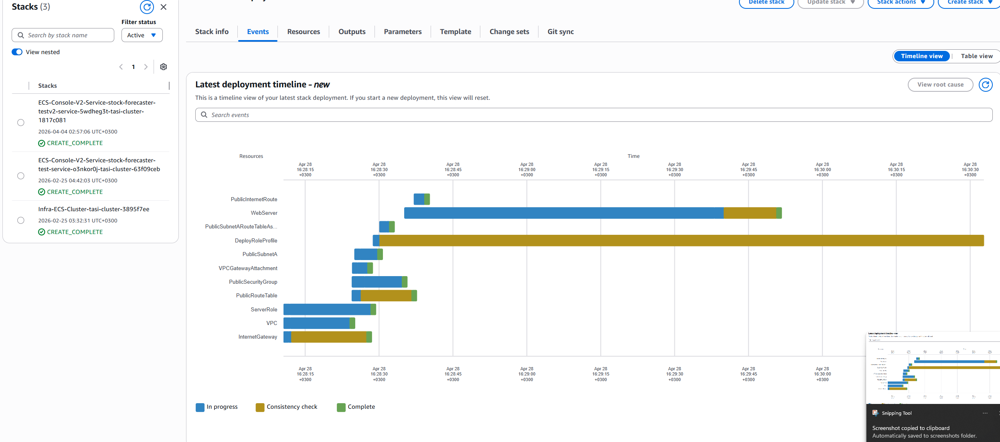
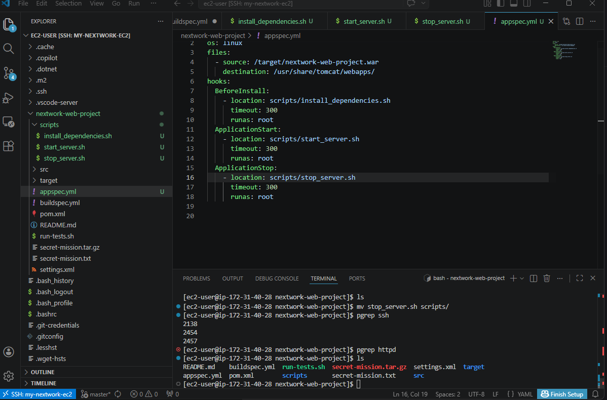
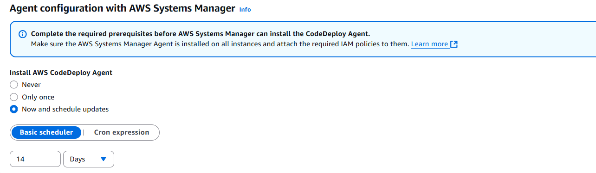
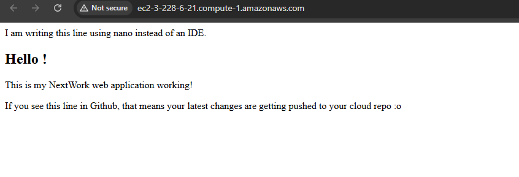
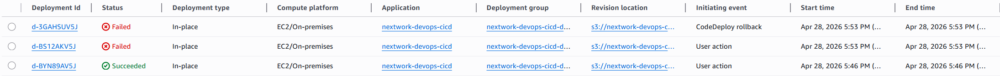

# Deploy a Web App with CodeDeploy


---


---

## Introducing Today's Project!

In this project, I set up AWS CodeDeploy to automatically deploy my Java web application to an EC2 instance. This is part five of the 6 Day DevOps Challenge where I'm building a complete CI/CD pipeline.

### Key tools and concepts

| Tool/Concept | Purpose |
|--------------|---------|
| **AWS CodeDeploy** | Continuous deployment service that automates application deployments |
| **AWS CloudFormation** | Infrastructure as Code tool to create AWS resources from a template |
| **appspec.yml** | Configuration file that tells CodeDeploy how to handle deployment |
| **Deployment Group** | Collection of EC2 instances that receive the deployment |
| **Deployment Scripts** | Bash scripts that run during different lifecycle events |
| **Rollback** | Ability to revert to a previous working version after failed deployment |
| **CodeDeploy Agent** | Software on EC2 that communicates with CodeDeploy |

### Project reflection

This project took me approximately **3-4 hours** to complete. The most challenging part was troubleshooting the deployment failures - first missing scripts, then the intentional typo in stop_server.sh that caused rollback to fail. It was most rewarding to see my web app live in the browser after a successful deployment.

I did this project because automating deployments eliminates manual, error-prone steps and enables consistent, repeatable rollouts.

This project is part five of a series of DevOps projects where I'm building a CI/CD pipeline! In the final project, I'll bring everything together with AWS CodePipeline.

---

## Deployment Environment

To set up for CodeDeploy, I launched an EC2 instance and VPC using **AWS CloudFormation** - an Infrastructure as Code tool that creates resources from a template file. Instead of clicking around the AWS console manually, I wrote a template that describes everything needed (EC2 instance, security groups, VPC, subnets) and CloudFormation builds it exactly the same way every time.

Instead of launching these resources manually, I used the `nextworkwebapp.yaml` CloudFormation template. When I need to delete these resources later, I just delete the CloudFormation stack and everything is removed together.

Other resources created in this template include a **VPC, subnet, route tables, internet gateway, and security group**. They're also in the template because a production EC2 instance needs networking resources to communicate with the internet and stay secure.





---

## Deployment Scripts

**Scripts** are mini-programs that automate tasks - text files filled with commands that run automatically in sequence. To set up CodeDeploy, I wrote three scripts inside a `scripts/` folder:

```bash
#!/bin/bash
sudo yum install tomcat -y
sudo yum -y install httpd
sudo cat << EOF > /etc/httpd/conf.d/tomcat_manager.conf
<VirtualHost *:80>
  ServerAdmin root@localhost
  ServerName app.nextwork.com
  DefaultType text/html
  ProxyRequests off
  ProxyPreserveHost On
  ProxyPass / http://localhost:8080/nextwork-web-project/
  ProxyPassReverse / http://localhost:8080/nextwork-web-project/
</VirtualHost>
EOF
```
This script installs Tomcat (Java application server) and Apache HTTP server (web server), then configures Apache as a reverse proxy to forward requests to Tomcat.

---

## appspec.yml

Then, I wrote an appspec.yml file to tell CodeDeploy how to handle the deployment

I also updated buildspec.yml because CodeBuild needed to package the appspec.yml and scripts/ folder into the build artifact along with the WAR file:




---

## Setting Up CodeDeploy

A CodeDeploy application is like the main folder for your deployment project - it organizes everything related to deploying one application.

A deployment group is a collection of EC2 instances that receive the deployment together. It defines where and how the application gets deployed (deployment type, environment configuration, load balancing settings).

To set up a deployment group, I also created an IAM role called NextWorkCodeDeployRole with the AWSCodeDeployRole policy attached, allowing CodeDeploy to access EC2 instances, S3, and CloudWatch.

Tags are helpful for identifying which EC2 instances should receive the deployment. I used the tag role: webserver - the same tag from my CloudFormation template - so CodeDeploy automatically found the correct EC2 instance.




---

## Deployment configurations

Another key setting is the deployment configuration, which affects how quickly you roll out your application. I used CodeDeployDefault.AllAtOnce - this deploys to all instances simultaneously, which is fastest but riskiest (we only have one instance, so it's fine).

In order to connect, a CodeDeploy Agent is also set up on the EC2 instance. The agent receives deployment instructions from CodeDeploy and carries them out. I configured it to update every 14 days to stay current.




---

## Success!

A CodeDeploy deployment represents a single update to your application - it tells CodeDeploy which version to deploy, where to deploy it, and how to deploy it. The difference to a deployment group is that a deployment is a one-time action, while a deployment group is a reusable configuration.

I had to configure a revision location, which means telling CodeDeploy where to find the build artifact in S3. My revision location was the S3 URI of my ZIP file from CodeBuild: s3://nextwork-devops-cicd/nextwork-devops-cicd-artifact.zip.

To check that the deployment was a success, I visited the EC2 instance's Public IPv4 DNS in my browser. I saw my web application running live!


---

## Disaster Recovery

In a project extension, I decided to test disaster recovery by intentionally creating a broken deployment. The intentional error I created was a typo in stop_server.sh - changing systemctl to systemctll (misspelled). This caused the deployment to fail because CodeDeploy couldn't find the invalid command.

When my deployment failed, the automatic rollback also failed because CodeDeploy's rollback doesn't reuse the previous successful build artifact - it only reuses the deployment configuration. The failed rollback still referenced the S3 artifact containing the broken script.

To actually recover from a failed deployment, I'd have to:

Fix the code locally

Commit and push to GitHub

Rebuild with CodeBuild

Redeploy with CodeDeploy

In production environments with proper CI/CD pipelines (like AWS CodePipeline), true automated rollbacks that reference specific known-good artifacts are possible.




---

---
