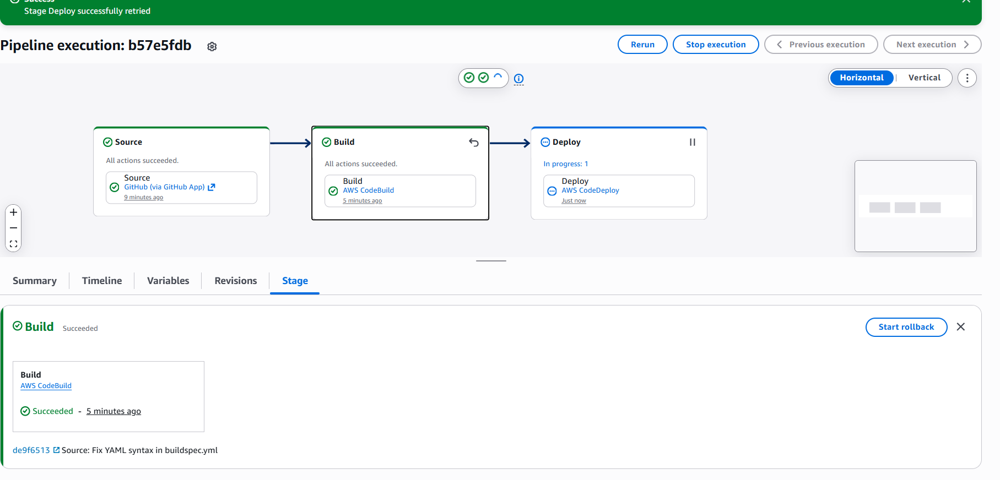
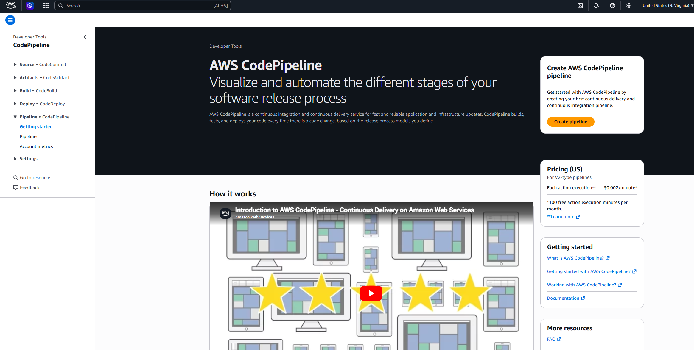
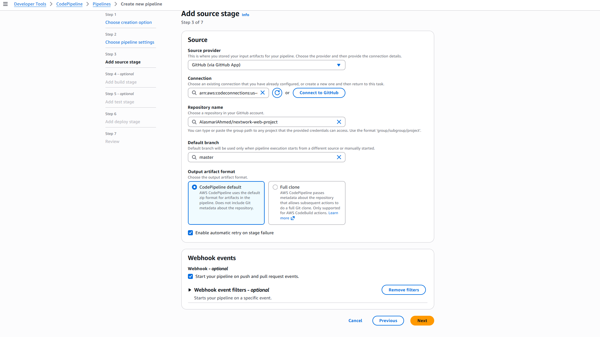
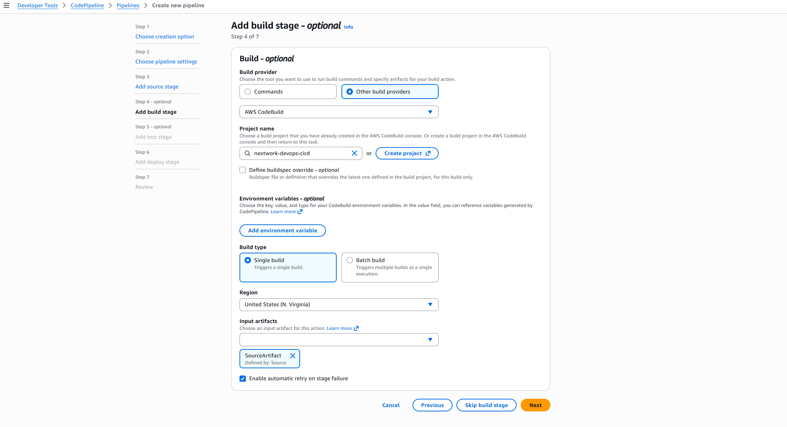
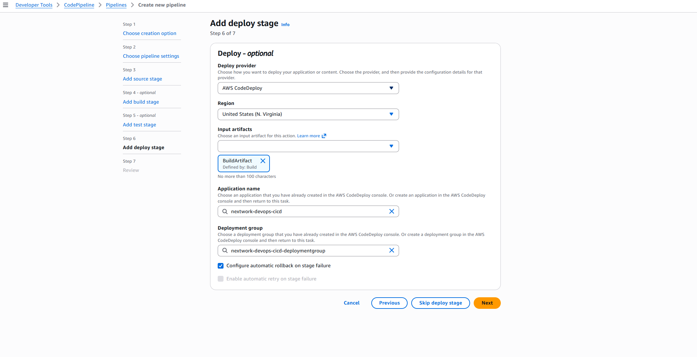
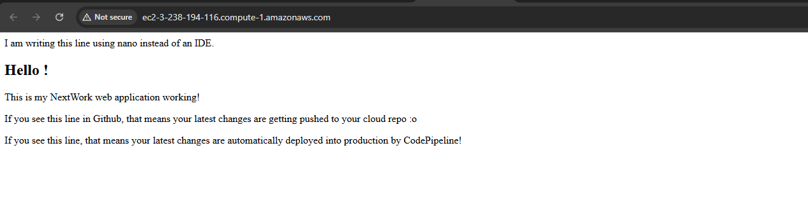
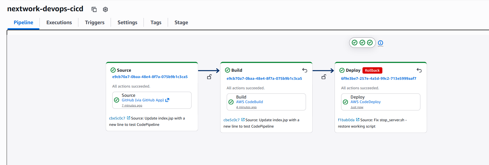

# Build a CI/CD Pipeline with AWS

---

---

## Introducing Today's Project!

In this project, I built a complete CI/CD pipeline using AWS CodePipeline that automatically builds and deploys my web application whenever code changes are pushed to GitHub. This is the final project of the 6 Day DevOps Challenge, bringing together everything I learned.
### Key tools and concepts

| Tool/Concept | Purpose |
|--------------|---------|
| **AWS CodePipeline** | Orchestrates the entire CI/CD workflow from source to deployment |
| **Source Stage** | Fetches code from GitHub when changes are detected |
| **Build Stage** | Uses CodeBuild to compile and package the application |
| **Deploy Stage** | Uses CodeDeploy to deploy to EC2 instances |
| **Webhook** | Automatically triggers pipeline on code pushes |
| **Execution Mode** | Determines how multiple pipeline runs are handled |
| **Rollback** | Reverts to previous successful deployment on failure |

### Project reflection

This project took me approximately **2-3 hours** to complete. The most challenging part was ensuring all the pieces (GitHub, CodeBuild, CodeDeploy) were correctly connected in CodePipeline. It was most rewarding to see the pipeline automatically trigger after a code push and watch the new version appear live on my web app.

I did this project to understand how all the AWS DevOps services work together as a complete CI/CD system - automating everything from code commit to production deployment.

---

## Starting a CI/CD Pipeline

**AWS CodePipeline** is a fully managed service that orchestrates the entire release process - from source code to production. It automates the build, test, and deploy phases every time code changes.

CodePipeline offers different execution modes based on how you want to handle multiple pipeline runs. I chose **Superseded** mode, where newer executions cancel older ones - perfect for ensuring only the latest code changes are processed. Other options include **Queued** (executions wait in line) and **Parallel** (multiple executions run simultaneously).

A service role gets created automatically during setup so CodePipeline has permission to access other AWS services (like S3 for artifacts, CodeBuild for builds, and CodeDeploy for deployments).

---

## CI/CD Stages

The three stages I've set up in my CI/CD pipeline are:

| Stage | Purpose |
|-------|---------|
| **Source** | Fetches code from GitHub repository |
| **Build** | Compiles and packages using CodeBuild |
| **Deploy** | Deploys to EC2 using CodeDeploy |

While setting up each part, I learned that CodePipeline organizes the three stages into a linear workflow. In each stage, you can view execution details, logs, and timestamps to monitor progress.

---

## Source Stage

In the Source stage, I connected CodePipeline to my GitHub repository (`nextwork-web-project`). The **default branch** (set to `master`) tells CodePipeline which branch to monitor for changes.

The source stage is also where you enable **webhook events**, which are like digital notifications. When enabled, GitHub sends a webhook to CodePipeline whenever code is pushed to the specified branch, automatically triggering a new pipeline execution. This is what makes the pipeline truly "continuous"!

- **Output artifact format**: I kept the default ZIP format (efficient, no Git metadata)
- **Detect change events**: Enabled for automatic triggers

---

## Build Stage

The Build stage sets up the transformation of source code into deployable artifacts. I configured CodePipeline to use my existing CodeBuild project (`nextwork-devops-cicd`).

The **input artifact** for the build stage is `SourceArtifact` - the ZIP file containing source code from the Source stage. CodeBuild then:
1. Compiles the Java code
2. Runs tests (if configured)
3. Packages the WAR file
4. Outputs `BuildArtifact` for the Deploy stage

---

## Deploy Stage

The Deploy stage is where the application finally goes live. I configured CodePipeline to use my existing CodeDeploy application (`nextwork-devops-cicd`) and deployment group (`nextwork-devops-cicd-deploymentgroup`).

Key configuration:
- **Input artifact**: `BuildArtifact` from the Build stage
- **Deployment group**: Targets EC2 instances tagged with `role: webserver`
- **Automatic rollback**: Enabled on stage failure

The Deploy stage takes the WAR file from S3, uses CodeDeploy to copy it to the EC2 instance, and runs the deployment scripts (`install_dependencies.sh`, `start_server.sh`, etc.).

---

## Success!

Since my CI/CD pipeline gets triggered by **webhooks**, I tested my pipeline by pushing a code change to GitHub. I added a new line to `index.jsp`:

The moment I pushed the code change, CodePipeline automatically started a new execution. The commit message under each stage reflected my latest commit, proving the pipeline was triggered by the webhook.

Once my pipeline executed successfully, I checked my web application in the browser using the EC2 instance's Public IPv4 DNS - the new line appeared! 🎉

---

## Testing the Pipeline

In a project extension, I initiated a rollback on the Deploy stage. Automatic rollback is important for minimizing downtime when a deployment fails - it tells CodePipeline to revert to the last successful deployment.

During the rollback, the Source and Build stages are not re-executed because the issue was only in the deployment (e.g., a failed script or misconfigured server). I could verify this by comparing the commit messages - the Source stage showed the latest commit, while the Deploy stage reverted to the previous working version.

After the rollback completed, the live web app reverted to its previous state (the new line disappeared from the page). This demonstrates that CodePipeline can recover from deployment failures without needing to rebuild the code!

Why rollback only the Deploy stage? This is useful when:

The source code and build are correct, but deployment has errors

A deployment script (like install_dependencies.sh) has a bug

A new third-party service is unavailable

Performance issues appear only in production

---

---
